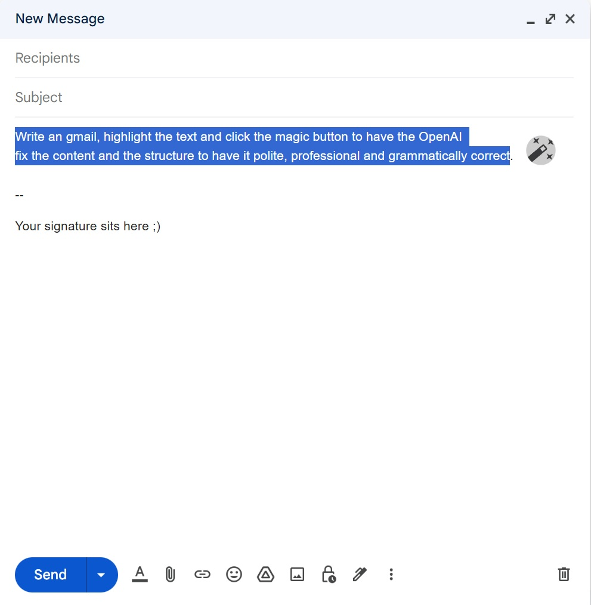

# FormalizeIt

> Chrome extension - Gmail add-on to help write more proffesional and polite emails using OpenAI.

## Table of contents

- [General info](#general-info)
- [Usage](#usage)
- [Screenshots](#screenshots)
- [Technologies](#technologies)
- [Chrome store link](#chrome-store-link)

## General info

A Chrome browser extension which inserts a magic button to your Gmail compose/reply window so you have the OpenAI service help you write more professional and respectable emails. User is expected to register to OpenAI to aquire the API access key so the application can be utilized.

**This was a final project for my CS50x certification where I aimed to make something useful while learning additional but new and relevant technology.**

## Usage

1. Install the extension from the Chrome store
2. If not already, register at [OpenAI](https://platform.openai.com/signup?launch) to get your OpenAI API key
3. Once registered, choose "API" after login and in the dashboard menu under "Personal", do the "View API keys" and create na new on. **Take a note** that they'll show it to you only once, so make sure you paste it somewhere safe.
4. Click on the extension icon under Chrome extensions and configuration pop-up will appear. Paste your API key there.
5. You are good to go. On each email compose/reply windows, a "magic wand" button will appear. To convert your text, highlight it, then click the magic button.

## Screenshots

## Technologies

- Plain JavaScript, CSS3, HTML5
- OpenAI API with davinci-003 model for text conversion
- Chrome storage API for light data persistance

## Chrome Store Link

Chrome extension available [here](https://chrome.google.com/webstore/detail/formalizeit/cknpomjgcpiikoconfeahlgikeidmdbi).